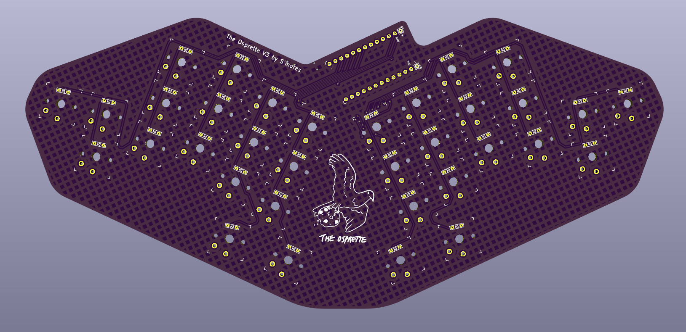

The Osprette V3
=============

The Osprette V3 is the 3rd revision of the [Osprette][osprette]. It's a 34-key unibody that runs on any pro-micro compatible daughterboard. It comes with bluetooth support by way of battery terminals and a power switch. It is direct solder (AKA no hotswap) for maximum stability of the switches.

# Ordering One

To order one of these from JLC, just upload the `osprette_v3.zip` archive to the Order Now page at <https://jlcpcb.com>,
and make sure to set a 1.6mm thickness. Removing the order number is always recommended.

# Pictures

_More to come when PCB's arrive!_

[osprette]: https://github.com/smores56/osprette
